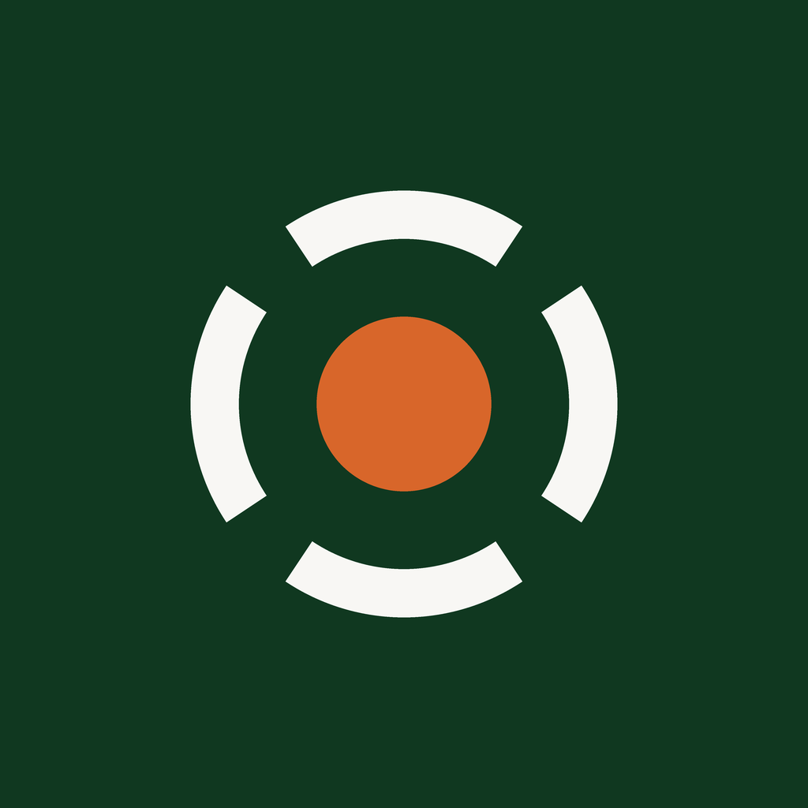
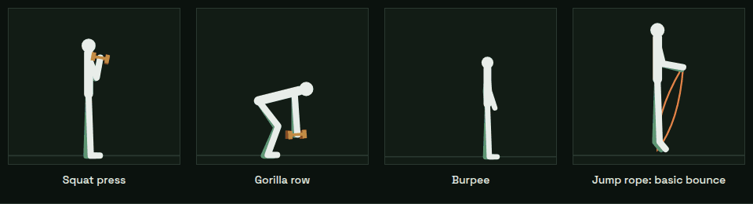
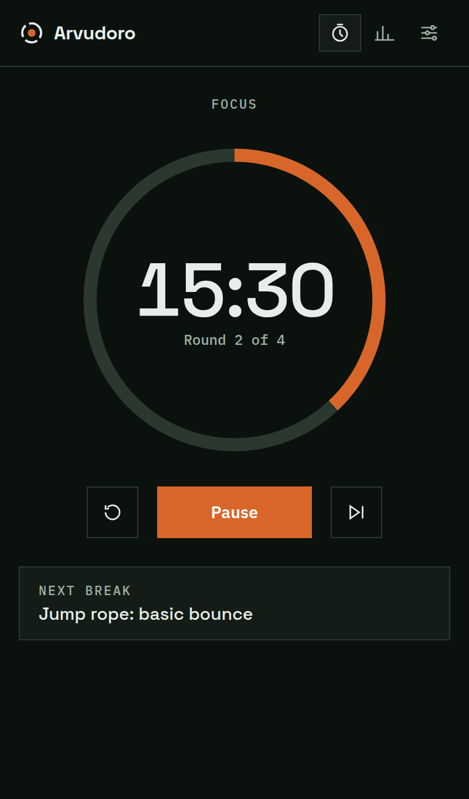
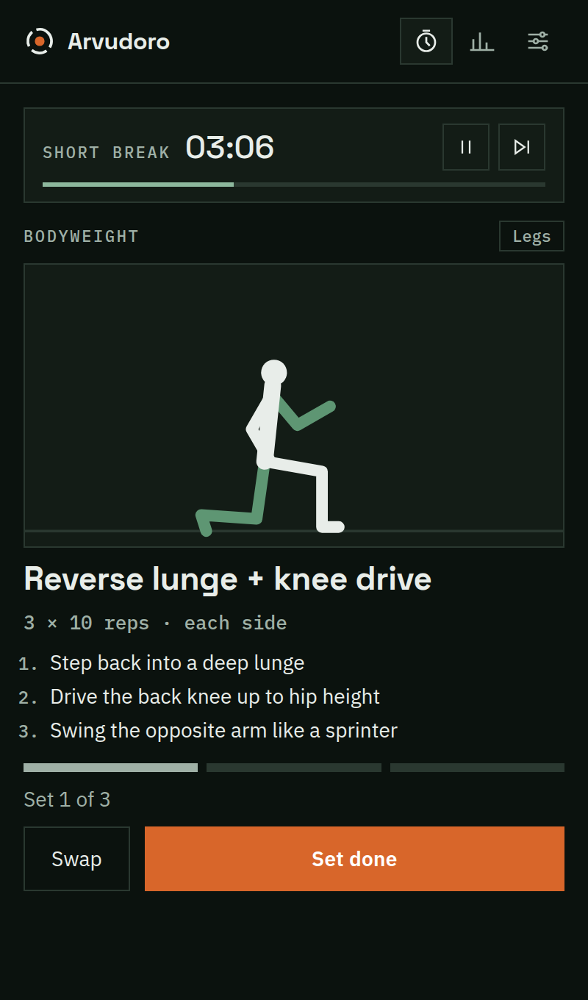
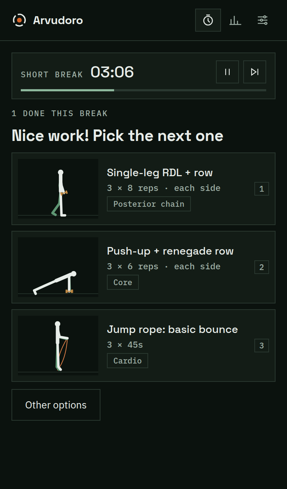
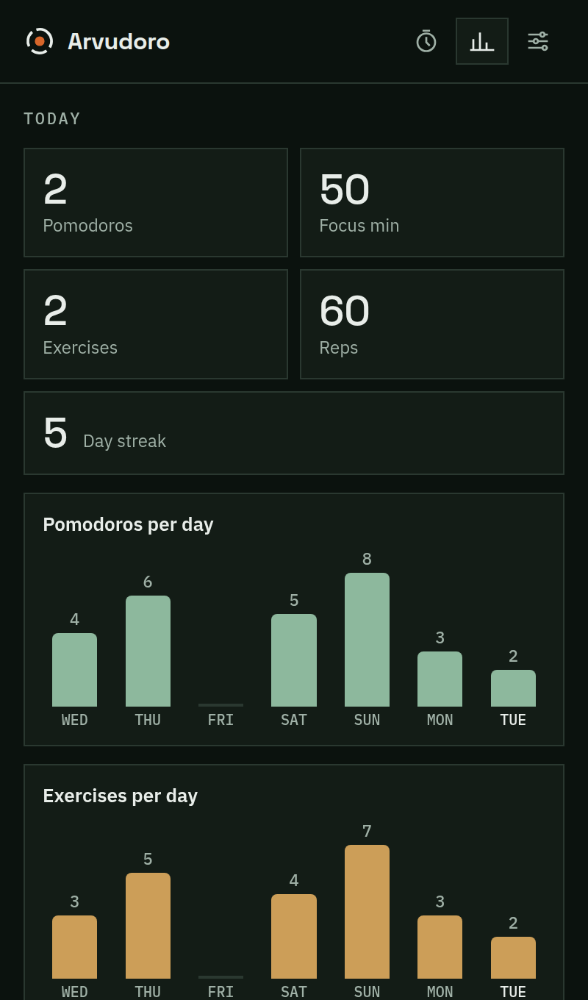

<p align="center">
  
</p>

<h1 align="center">Arvudoro</h1>

<p align="center">
  The pomodoro timer whose breaks make you move.<br>
  <a href="https://github.com/samoaste/arvudoro/releases/latest">Download</a> ·
  <a href="README.pt-BR.md">Português</a> ·
  <a href="CONTRIBUTING.md">Contribute</a>
</p>

<p align="center">
  <a href="https://github.com/samoaste/arvudoro/actions/workflows/ci.yml"></a>
  <a href="https://github.com/samoaste/arvudoro/releases/latest"></a>
  <a href="LICENSE"></a>
</p>

Each break brings a compound exercise, animated step by step, that you can do
with dumbbells, a pull-up bar, a jump rope or just your body. Finish your sets,
pick the next move, and keep going until the break ends. Free and open source, by [Arvucore](https://github.com/samoaste).

<p align="center">
  
</p>

<p align="center">
  
  
  
  
</p>

## Features

- **Timer** — focus, short break, long break and rounds; tray icon with
  progress, desktop notifications, sounds, always-on-top, auto-start options.
- **Active breaks** — 21 compound moves (squat press, reverse lunge + curl,
  RDL + rear delt raise, gorilla row, thruster, man maker, burpee, chin-up +
  knee raise, jump rope…) with an animated demonstration, sets × reps or
  timed sets, and form cues.
- **Keep moving** — when you finish an exercise, pick the next one from three
  animated suggestions and chain moves until the break is over. Long breaks
  suggest a circuit first.
- **Smart rotation** — never the same move twice in a row, never the same
  muscle group back to back, filtered by the equipment you own.
- **Stats** — pomodoros, focus minutes, exercises, reps and your day streak.
- **English and Brazilian Portuguese**, dark and light themes.
- **Private** — no account, no telemetry; everything stays on your computer
  ([privacy](PRIVACY.md)).

Keyboard: <kbd>Space</kbd> start/pause · <kbd>S</kbd> skip · <kbd>R</kbd>
restart phase · <kbd>Enter</kbd> set done · <kbd>1</kbd>–<kbd>3</kbd> pick the next exercise · <kbd>Ctrl</kbd>+<kbd>1</kbd>/<kbd>2</kbd>/<kbd>,</kbd>
timer, stats, settings.

## Download

Get the latest build for Linux, macOS or Windows from
[Releases](https://github.com/samoaste/arvudoro/releases/latest). Installed
apps update themselves.

| OS | File | Notes |
|---|---|---|
| Linux | `arvudoro-<version>-linux-x86_64.tar.gz` (or `arm64`) | Easiest without root: the one-line install below. Needs `webkit2gtk-4.1` (preinstalled on Ubuntu 22.04+, Fedora 38+). |
| macOS 14+ | `arvudoro-<version>.zip` / `.dmg` | Not notarized yet: right-click → Open the first time. |
| Windows 10/11 | `arvudoro-<version>-win.zip` | Extract and run `arvudoro.exe`. Beta. |

Install on any Linux for your user only (into `~/.local`, no root; run it again to update):

```sh
curl -fsSL https://raw.githubusercontent.com/samoaste/arvudoro/main/packaging/linux/install.sh | sh
```

Uninstall with the same command followed by `-s -- --uninstall`.

## Develop

Arvudoro is a [tinyjs](https://tinyjs.app) app: a txiki.js backend and a
native webview, about 10 MB shipped.

```sh
curl -fsSL https://tinyjs.app/install | sh   # once
tinyjs dev       # run with hot reload
npm test         # rotation and catalog tests (Node 22+)
tinyjs build     # package for the current OS
```

```
src/main.js                backend: timer state machine, tray, notifications, SQLite stats
src/frontend/app.js        UI: views, break flow, settings, stats
src/frontend/rig.js        stick-figure rig: forward kinematics + keyframe player
src/frontend/exercises.js  exercise catalog (poses, dosage, cues in en/pt)
src/frontend/rotation.js   exercise picking rules
dev/                       browser previews, GIF and social-image generators
packaging/                 distribution channels and release checklist
```

Adding an exercise is adding data, not drawing: see
[CONTRIBUTING.md](CONTRIBUTING.md).

## Support

Arvudoro is free. If it keeps you moving, you can
[buy me a coffee](https://buymeacoffee.com/samoaste).

## Health note

The exercises are general fitness movements, not medical advice. Move within
your limits and stop if something hurts.

## License

[MIT](LICENSE). Fonts: Space Grotesk and IBM Plex, SIL Open Font License
(`src/frontend/fonts/`). Sounds and animations are original to this project.
