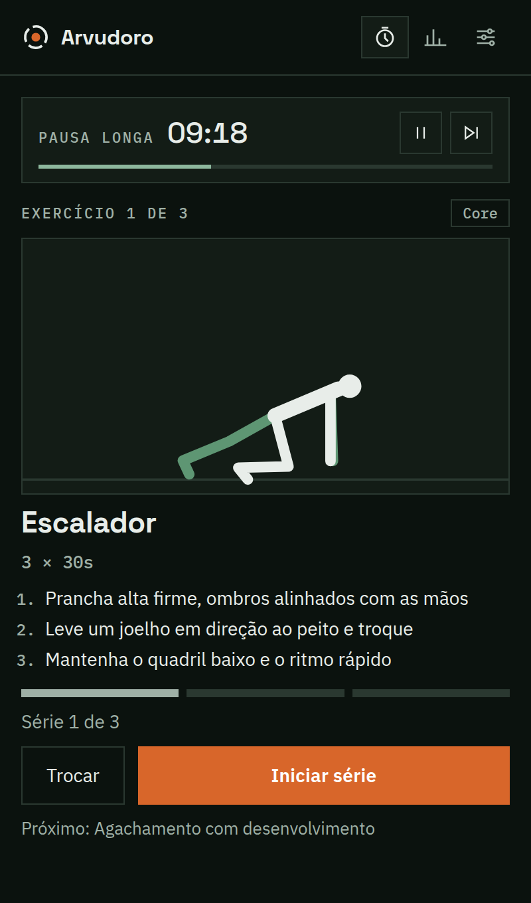

<p align="center">
  
</p>

<h1 align="center">Arvudoro</h1>

<p align="center">
  O timer pomodoro em que cada pausa faz você se mexer.<br>
  <a href="https://github.com/samoaste/arvudoro/releases/latest">Baixar</a> ·
  <a href="README.md">English</a> ·
  <a href="CONTRIBUTING.md">Contribuir</a>
</p>

Cada pausa traz um exercício composto, animado passo a passo, que você faz com
halteres, barra fixa, corda de pular ou o próprio corpo. A pausa longa vira um
circuito curto. Gratuito e de código aberto, feito pela [Arvucore](https://github.com/samoaste).

<p align="center">
  
</p>

<p align="center">
  
</p>

## Recursos

- **Timer**: foco, pausa curta, pausa longa e rodadas. Ícone na bandeja com o
  progresso, notificações, sons, janela sempre no topo e início automático.
- **Pausas ativas**: 21 exercícios compostos (agachamento com desenvolvimento,
  afundo reverso + rosca, stiff + crucifixo invertido, remada gorila,
  thruster, man maker, burpee, barra + elevação de joelhos, pular corda…),
  cada um com animação, séries × repetições ou séries por tempo, e dicas de
  execução.
- **Rodízio inteligente**: nunca repete o exercício em sequência nem o mesmo
  grupo muscular em pausas seguidas, e só sorteia exercícios dos equipamentos
  que você tem.
- **Estatísticas**: pomodoros, minutos de foco, exercícios, repetições e dias
  seguidos.
- **Português do Brasil e inglês**, temas escuro e claro.
- **Privado**: sem conta e sem telemetria. Tudo fica no seu computador
  ([privacidade](PRIVACY.md)).

Atalhos: <kbd>Espaço</kbd> inicia/pausa · <kbd>S</kbd> pula · <kbd>R</kbd>
reinicia a etapa · <kbd>Enter</kbd> marca a série · <kbd>Ctrl</kbd>+<kbd>1</kbd>/<kbd>2</kbd>/<kbd>,</kbd>
timer, estatísticas, ajustes.

## Download

Baixe a versão mais recente para Linux, macOS ou Windows em
[Releases](https://github.com/samoaste/arvudoro/releases/latest). O app se
atualiza sozinho.

| Sistema | Arquivo | Observações |
|---|---|---|
| Linux | `arvudoro-<versão>-linux-x86_64.tar.gz` (ou `arm64`) | Extraia e rode `arvudoro/arvudoro`; ele se adiciona ao menu de aplicativos. Precisa do `webkit2gtk-4.1` (já vem no Ubuntu 22.04+ e Fedora 38+). |
| macOS 14+ | `arvudoro-<versão>.zip` / `.dmg` | Ainda sem notarização: na primeira vez, clique com o botão direito → Abrir. |
| Windows 10/11 | `arvudoro-<versão>-win.zip` | Extraia e rode `arvudoro.exe`. Versão beta. |

## Desenvolvimento

O Arvudoro é um app [tinyjs](https://tinyjs.app): backend em txiki.js e uma
webview nativa, com cerca de 10 MB.

```sh
curl -fsSL https://tinyjs.app/install | sh   # uma vez
tinyjs dev       # roda com hot reload
npm test         # testes do rodízio e do catálogo (Node 22+)
tinyjs build     # empacota para o sistema atual
```

Adicionar um exercício é adicionar dados, não desenhar. Veja o
[CONTRIBUTING.md](CONTRIBUTING.md).

## Aviso de saúde

Os exercícios são movimentos gerais de condicionamento, não orientação médica.
Respeite seus limites e pare se sentir dor.

## Licença

[MIT](LICENSE). Fontes: Space Grotesk e IBM Plex, SIL Open Font License
(`src/frontend/fonts/`). Sons e animações foram criados para este projeto.
